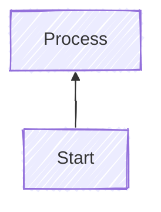

# YAML Frontmatter Support - Implementation Summary

## Problem

Mermaid diagrams with YAML frontmatter configuration were not being properly detected or processed for narrative generation. For example:



This diagram was showing as "unknown diagram" instead of being recognized as a flowchart.

## Root Cause

The `detectDiagramType()` function was reading the first line of the source to determine the diagram type. When YAML frontmatter was present, the first line was `---` instead of the actual diagram declaration (`graph BT`, `flowchart TD`, etc.).

## Solution

### 1. Added `skipFrontmatter()` Helper Function

Created a utility function that detects and skips YAML frontmatter blocks:

```javascript
function skipFrontmatter(source) {
  const lines = source.trim().split('\n');
  if (lines[0].trim() === '---') {
    // Find the closing ---
    for (let i = 1; i < lines.length; i++) {
      if (lines[i].trim() === '---') {
        // Return everything after the closing ---
        return lines.slice(i + 1).join('\n');
      }
    }
  }
  return source;
}
```

### 2. Updated `detectDiagramType()`

Modified the function to skip frontmatter before detecting diagram type:

```javascript
function detectDiagramType(source) {
  // Skip YAML frontmatter if present
  const sourceWithoutFrontmatter = skipFrontmatter(source);
  const lines = sourceWithoutFrontmatter.trim().split('\n');
  const firstLine = lines[0].trim();
  
  // ... rest of detection logic
}
```

### 3. Updated All Narrative Generators

Applied the same frontmatter skipping logic to all narrative generators:

- `generateFlowchartNarrative()`
- `generatePieNarrative()`
- `generateClassDiagramNarrative()`
- `generateGanttNarrative()`
- `generateUserJourneyNarrative()`
- `generateMindmapNarrative()`
- `generateTimelineNarrative()`
- `generateXyChartNarrative()`

### 4. Enhanced Flowchart Parser

Improved the flowchart narrative generator to:
- Support all Mermaid node shapes (not just `[]` and `{}`)
  - Rectangles: `[text]`
  - Circles: `((text))`
  - Rounded: `(text)`
  - Diamonds: `{text}`
  - Hexagons: `{{text}}`
  - Stadiums: `([text])`
  - And many more
- Filter out structural keywords:
  - `subgraph`
  - `end`
  - `direction`
  - `class`
  - `classDef`
- Handle multiple edge arrow styles:
  - `-->`
  - `--->`
  - `---->`

## Test Coverage

Added comprehensive test suite in `tests/frontmatter.test.js`:

✅ Tests `skipFrontmatter()` function:
- Correctly skips frontmatter delimited by `---`
- Returns source unchanged when no frontmatter present
- Handles multi-line frontmatter with complex YAML

✅ Tests diagram type detection with frontmatter:
- `graph BT` with frontmatter → flowchart
- `graph TB` with frontmatter → flowchart
- `flowchart LR` with frontmatter → flowchart
- `pie` with frontmatter → pie
- `gantt` with frontmatter → gantt
- Complex real-world W3C Goals diagram

All 96 tests passing (added 9 new tests).

## Diagram Directions Supported

The flowchart parser now properly handles all Mermaid flow directions:

- **TB** (Top to Bottom) - `flowchart TB` or `graph TB`
- **BT** (Bottom to Top) - `flowchart BT` or `graph BT`
- **LR** (Left to Right) - `flowchart LR` or `graph LR`
- **RL** (Right to Left) - `flowchart RL` or `graph RL`

## Files Modified

1. **app.js**
   - Added `skipFrontmatter()` function
   - Updated `detectDiagramType()` to use frontmatter skipping
   - Updated all 8 narrative generators to skip frontmatter
   - Enhanced flowchart parser for better node/edge detection

2. **tests/frontmatter.test.js** (new)
   - Comprehensive test coverage for frontmatter handling
   - 9 new passing tests

3. **test-frontmatter.html** (new, optional)
   - Manual browser testing page

## Benefits

1. **Full Mermaid Spec Compliance**: Supports the standard Mermaid frontmatter syntax for configuration
2. **Better Diagram Detection**: Correctly identifies diagram types regardless of config presence
3. **Accurate Narratives**: All narrative generators work with frontmatter-enabled diagrams
4. **Enhanced Flowchart Support**: Handles complex diagrams with:
   - Multiple node shapes
   - Subgraphs
   - Custom styling
   - Various arrow types
5. **Regression Protection**: Comprehensive test coverage ensures future changes don't break frontmatter support

## Example Output

For the W3C Goals diagram with frontmatter, the tool now correctly:

- **Detects**: "flowchart" (not "unknown")
- **Generates narrative**: Lists all nodes and connections
- **Applies accessibility**: Semantic structure with roles, titles, descriptions
- **Exports correctly**: Clean SVG with proper ARIA attributes

## References

- [Mermaid Configuration Documentation](https://mermaid.js.org/config/configuration.html)
- [Mermaid Frontmatter Syntax](https://mermaid.js.org/config/configuration.html#frontmatter)
- [Flowchart Syntax](https://mermaid.js.org/syntax/flowchart.html)
- [Node Shapes Reference](https://mermaid.js.org/syntax/flowchart.html#node-shapes)
