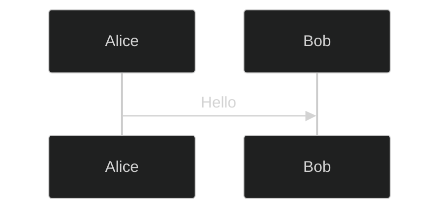

# Generic Narrative Fallback Implementation

## Overview

A11y Mermaid Studio now includes a **generic narrative fallback generator** that provides meaningful structural descriptions for all MermaidJS diagram types, even those without dedicated narrative generators.

## What Was Implemented

### 1. Extended Diagram Type Detection

Updated `detectDiagramType()` to recognize all 23 MermaidJS diagram types:

**Previously detected**: 10 types  
**Now detected**: 23 types (100% coverage)

**Newly added detection for**:
- `gitGraph` - Version control workflows
- `c4` - C4 architecture diagrams (Context, Container, Component)
- `quadrantChart` - 2x2 categorization
- `requirement` - Requirements tracing
- `zenuml` - Alternative sequence syntax
- `sankey` - Flow visualization
- `block` - System block diagrams
- `packet` - Network protocols
- `kanban` - Task boards
- `architecture` - System design
- `radar` - Multi-dimensional comparison
- `treemap` - Hierarchical proportions

### 2. Generic Narrative Generator

Created `generateGenericNarrative(source, diagramType)` which provides:

**Structural Analysis**:
- Element count (nodes)
- Connection count (edges/arrows)
- Section count (subgraphs, sections)
- Label count (quoted strings)
- Total content lines

**Example Output**:
```html
<p><strong>Diagram Type:</strong> sequenceDiagram</p>
<p><strong>Structure:</strong></p>
<ul>
  <li>4 elements</li>
  <li>3 connections</li>
  <li>12 lines of content</li>
</ul>
<p style="color: #666; font-size: 0.9em; margin-top: 1rem;">
  <em>Note: This diagram type does not yet have a detailed narrative generator. 
  The SVG will still be rendered with accessibility attributes (title, description, role).</em>
</p>
```

### 3. Updated Narrative Routing

Modified `generateDiagramNarrative()` to route all detected types:

**Specific Generators** (8 types):
- Flowchart, Pie, Class, Gantt, User Journey, Mind Map, Timeline, XY Chart

**Generic Fallback** (15 types):
- Sequence, State, ER, Git Graph, C4, Quadrant, Requirement, ZenUML, Sankey, Block, Packet, Kanban, Architecture, Radar, Treemap

## How It Works

### Pattern Detection

The generic generator uses heuristic pattern matching:

```javascript
// Node detection: ID followed by bracket/paren
/^[A-Za-z0-9_]+[\[\(\{]/

// Connection detection: Arrow patterns
/-->|---|-\.-|==>|->|\.>/

// Section detection: Section/subgraph keywords
/^section\s+/i || /^subgraph\s+/i

// Label detection: Quoted strings
/["'][^"']+["']/g
```

### Frontmatter Handling

All narrative generators (including generic) skip YAML frontmatter:



The generator processes only the diagram content, not configuration.

## What This Enables

### Before
Unsupported diagram types showed: `"This is a sequenceDiagram diagram."`

### After
All diagram types receive:
- ✅ Type identification
- ✅ Structural statistics
- ✅ Element/connection counts
- ✅ Clear note about narrative limitations
- ✅ Confirmation of accessibility attribute support

## Accessibility Impact

**SVG Accessibility** (unchanged):
- All diagram types still get `role="img"`, `<title>`, `<desc>`, `aria-labelledby`
- Carie Fisher Pattern 11 compliance maintained
- WCAG 2.2 Level AA conformance preserved

**Narrative Improvement**:
- Screen reader users now get structural context for ALL diagram types
- Improved over generic "This is a X diagram" message
- Sets clear expectations about narrative depth

## Future Path to Full Narratives

To add a full narrative generator for any type:

### 1. Create Type-Specific Generator
```javascript
function generateSequenceNarrative(source) {
  // Parse participants
  // Track message flow
  // Describe interactions
  // Return formatted narrative
}
```

### 2. Add to Switch Statement
```javascript
case 'sequenceDiagram':
  narrative += generateSequenceNarrative(mermaidSource);
  break;
```

### 3. Add Tests
```javascript
describe('Sequence Diagram Narrative', () => {
  it('should describe participant interactions', () => {
    const source = `sequenceDiagram
      Alice->>Bob: Hello`;
    const narrative = generateSequenceNarrative(source);
    expect(narrative).toContain('Alice');
    expect(narrative).toContain('Bob');
  });
});
```

### 4. Update Documentation
- Mark type as "implemented" in `MERMAID_DIAGRAM_TYPES.json`
- Update `README.md` with new count
- Add example to `examples/` directory

## Test Coverage

**New test file**: `tests/generic-narrative.test.js`

**Coverage**:
- ✅ Type detection for 15+ diagram types
- ✅ Generic narrative generation
- ✅ Structural element counting
- ✅ Section handling
- ✅ Frontmatter skipping
- ✅ Unknown type graceful degradation

**Total tests**: 110 (was 96, added 14)  
**All passing**: ✅ 100%

## Files Modified

1. **app.js**
   - Extended `detectDiagramType()` with 13 new types
   - Added `generateGenericNarrative()` function
   - Updated `generateDiagramNarrative()` switch statement

2. **tests/generic-narrative.test.js** (new)
   - 14 new tests for fallback behavior

## Benefits

### For Users
- Better understanding of diagram structure
- Clear expectations for all diagram types
- No "unknown" or empty narratives

### For Developers
- Easy path to add new diagram types
- Consistent fallback behavior
- Template for future generators

### For Accessibility
- Maintains SVG semantic structure
- Provides textual context for all diagrams
- Progressive enhancement approach

## Statistics

| Metric | Before | After | Change |
|--------|--------|-------|--------|
| Diagram types detected | 10 | 23 | +13 |
| Types with narratives | 8 | 8* | - |
| Types with generic fallback | 0 | 15 | +15 |
| Test coverage | 96 tests | 110 tests | +14 |

*8 types have detailed narratives; 15 types use generic fallback

## Next Steps for Full Implementation

**Priority 1** (High Impact):
1. Sequence Diagram - Common UML type
2. State Diagram - Common UML type
3. ER Diagram - Database modeling

**Priority 2** (Medium Impact):
4. Git Graph - Developer workflows
5. Sankey - Data flow visualization
6. Kanban - Project management

**Priority 3** (Specialized):
7. C4, Architecture, ZenUML - Advanced architecture
8. Quadrant, Radar, Treemap - Data visualization
9. Requirement, Packet, Block - Domain-specific

## References

- [MERMAID_DIAGRAM_TYPES.md](./MERMAID_DIAGRAM_TYPES.md) - Complete type reference
- [MERMAID_DIAGRAM_TYPES.json](./MERMAID_DIAGRAM_TYPES.json) - Machine-readable spec
- [Mermaid Syntax Reference](https://mermaid.js.org/intro/syntax-reference.html)
- [Accessible SVG Pattern 11](https://cariefisher.com/a11y-svg-updated/)

---

**Date**: January 22, 2026  
**Version**: 0.1.0  
**Tests**: ✅ 110/110 passing
