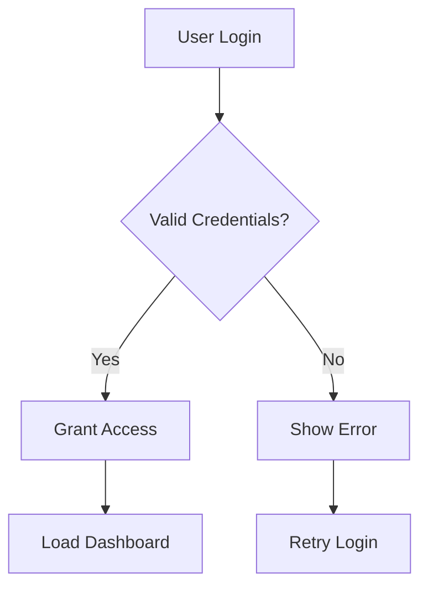

# Mermaid Accessibility Best Practices

AGPL-3.0-or-later License - See LICENSE file for full text  
Copyright (c) 2026 Mike Gifford

**Normative reference for authoring, annotation, linting, and the "Generate prompt to improve this diagram" workflow.**

Based on:
- Léonie Watson's [Accessible SVG flowcharts](https://tink.uk/accessible-svg-flowcharts/)
- Carie Fisher's [Accessible SVGs: Perfect Patterns For Screen Reader Users](https://cariefisher.com/a11y-svg-updated/)
- W3C ARIA Authoring Practices Guide
- WCAG 2.2 Level AA

---

## 1. Required Metadata

Every Mermaid diagram **must** include:

```mermaid
%%accTitle Brief title (max 100 characters)
%%accDescr Detailed description explaining what the diagram shows and why
```

### Title Requirements
- **Concise and descriptive** — Should identify the diagram type and subject
- **No more than 100 characters** — Accessible for all screen readers
- **Unique within page** — Each diagram needs its own title
- **Meaningful** — "Diagram" or "Flowchart" alone is insufficient

### Description Requirements
- **Complete explanation** — Describe the diagram's purpose, key elements, and relationships
- **Conversational tone** — Write as if explaining to someone who cannot see the visual
- **Include key decisions/branches** — For flowcharts: mention critical decision points
- **No more than 500 characters recommended** — Longer descriptions should consider alternative presentation

### Example: Decision Tree


---

## 2. SVG Accessibility Requirements

### Pattern 11 Implementation (Carie Fisher)

All output SVGs must implement **Pattern 11:**

```html
<svg role="img" aria-labelledby="title-id desc-id">
  <title id="title-id">Diagram Title</title>
  <desc id="desc-id">Diagram Description</desc>
  <!-- diagram content -->
</svg>
```

**Rationale:** Pattern 11 is the most reliable pattern across different screen reader/browser combinations. While it may repeat content in some configurations, it never ignores accessibility elements.

### Required Attributes
- `role="img"` — Required for consistent screen reader support
- `xmlns="http://www.w3.org/2000/svg"` — Required for standalone SVG usage
- `aria-labelledby="title-id desc-id"` — Both IDs must be referenced (aria-labelledby is more reliable than aria-describedby)

### ID Generation Rules
- All IDs must be **unique** within the SVG
- Use collision-resistant format: `{prefix}-{timestamp}-{randomString}`
- Preserve IDs across transformations when possible
- Never reuse IDs across multiple diagrams on same page

---

## 3. Semantic Structure for Flowcharts

Following Léonie Watson's patterns:

### Root-Level Structure
```html
<svg role="img" aria-labelledby="...">
  <title>...</title>
  <desc>...</desc>
  <g role="list">
    <!-- Each logical node -->
    <g role="listitem">
      <title>Node label</title>
      <!-- node content -->
    </g>
  </g>
</svg>
```

### Node Requirements
- Each node must have a **single accessible name** via `<title>`
- Node text must be **meaningful and non-repetitive**
- Decorative shapes must be **hidden from accessibility tree** (aria-hidden="true" or role="presentation")

### Edge/Link Handling
- Arrows/connectors are **hidden by default** (aria-hidden="true")
- Named links (e.g., "Yes"/"No" in decisions) must be **contextual**
- Example: `"Yes, proceed to processing"` instead of just `"Yes"`

---

## 4. Node Type Annotation (Future)

The tool should support optional annotations for node type inference:

```mermaid
%%a11y-node A type=question
%%a11y-node B type=statement
%%a11y-node C type=process
%%a11y-edge A->B ariaLabel="Yes, continue"
```

**Node Types:**
- `question` — Decision point (diamond, should contain a question)
- `statement` — Action or process (rectangle)
- `process` — Multi-step operation
- `endpoint` — Start or end (rounded rectangle)

---

## 5. Validation Rules

### Pre-Export Validation
Before exporting, the tool must verify:

1. **Metadata present** — Both `%%accTitle` and `%%accDescr` exist
2. **Title length** — ≤100 characters
3. **Description present** — ≥10 characters, ≤500 recommended
4. **SVG well-formed** — No parsing errors
5. **IDs unique** — No duplicate IDs within SVG
6. **Role attributes** — `role="img"` on root SVG
7. **ARIA labelledby** — Both title and desc IDs referenced
8. **Contrast** — WCAG 4.5:1 (text), 3:1 (non-text) in light AND dark modes

### Warnings (Non-blocking)
- Description > 500 characters (consider alternative presentation)
- Node with no accessible label (suggest adding title)
- Monochromatic diagram (no color validation possible)

### Errors (Blocking Export)
- Missing `%%accTitle`
- Missing `%%accDescr`
- Invalid Mermaid syntax
- Contrast failures in both light and dark modes

---

## 6. Dark Mode Handling

### Theming Requirements
- **Light mode default** — WCAG 4.5:1 text, 3:1 non-text
- **Dark mode support** — Same contrast ratios must apply
- **Color strategy** — Use CSS custom properties or `currentColor` where possible
- **Validation** — Both themes must pass contrast checks

### Example SVG with Dark Mode Support
```html
<svg role="img" xmlns="http://www.w3.org/2000/svg">
  <title>Data Flow</title>
  <desc>Shows data moving from input to output</desc>
  <style>
    @media (prefers-color-scheme: dark) {
      .line { stroke: #e0e0e0; }
      .text { fill: #ffffff; }
    }
  </style>
  <!-- diagram content -->
</svg>
```

---

## 7. Linting Checklist

Apply this checklist before accepting any diagram for export:

- [ ] `%%accTitle` present and ≤100 chars
- [ ] `%%accDescr` present and ≥10 chars
- [ ] SVG has `role="img"`
- [ ] SVG has `xmlns="http://www.w3.org/2000/svg"`
- [ ] `<title>` element exists with unique ID
- [ ] `<desc>` element exists with unique ID
- [ ] `aria-labelledby` references both title and desc IDs
- [ ] All IDs are unique within SVG
- [ ] Decorative elements have aria-hidden or role="presentation"
- [ ] WCAG contrast passes in light mode (4.5:1 text, 3:1 non-text)
- [ ] WCAG contrast passes in dark mode (4.5:1 text, 3:1 non-text)
- [ ] No parsing errors in Mermaid source
- [ ] No parsing errors in SVG output

---

## 8. User Prompts for Improvement

When the tool detects ambiguity, it must prompt the user:

### Decision Node Prompt
```
Is this a decision point (question)?
⚫ Yes, this is a decision (e.g., "Check if valid?")
⚫ No, this is an action/process (e.g., "Check password")
```

### Edge Label Prompt
```
Add contextual label for "Yes" branch:
[Example: "Yes, create account"]
```

### Description Clarification
```
Your description is very brief. Consider explaining:
- What triggers this diagram?
- What are the key decision points?
- What happens at the end?
```

---

## 9. Contrast Checking (WCAG 2.x and APCA)

### WCAG Contrast Ratio
Calculate per WCAG formula:
```
(Lmax + 0.05) / (Lmin + 0.05)
```

Where L (luminance) is calculated from RGB:
```
L = 0.2126 * R + 0.7152 * G + 0.0722 * B
(with component gamma adjustments)
```

### APCA (Advanced Perceptual Contrast Algorithm)
**Note:** APCA applies **only to text**, not decorative fills.

- Text against background: Use APCA values for reference
- Non-text (shapes, borders): Use WCAG only

### Validation Thresholds
- **Light mode** — WCAG 7:1 preferred, 4.5:1 minimum for text
- **Dark mode** — Same ratios
- **Non-text** — 3:1 minimum in both modes
- **Large text** (18px+) — May use 3:1

---

## 10. Known Limitations

Document these limitations in diagram metadata or UI:

1. **Mermaid's native a11y support** is limited; this tool enhances it
2. **Very complex diagrams** may need alternative representations
3. **Color-only differentiation** (e.g., different colors for status) should include additional indicators
4. **Monochromatic diagrams** cannot have contrast validated
5. **Animation support** depends on Mermaid version

---

## References

- **Léonie Watson's Accessible SVG Flowcharts**: https://tink.uk/accessible-svg-flowcharts/
- **Carie Fisher's Pattern Testing**: https://cariefisher.com/a11y-svg-updated/
- **W3C ARIA**: https://www.w3.org/WAI/ARIA/apg/
- **WCAG 2.2**: https://www.w3.org/WAI/WCAG22/quickref/

---

**Last Updated:** January 16, 2026  
**Version:** 1.0  
**Status:** Normative Reference
