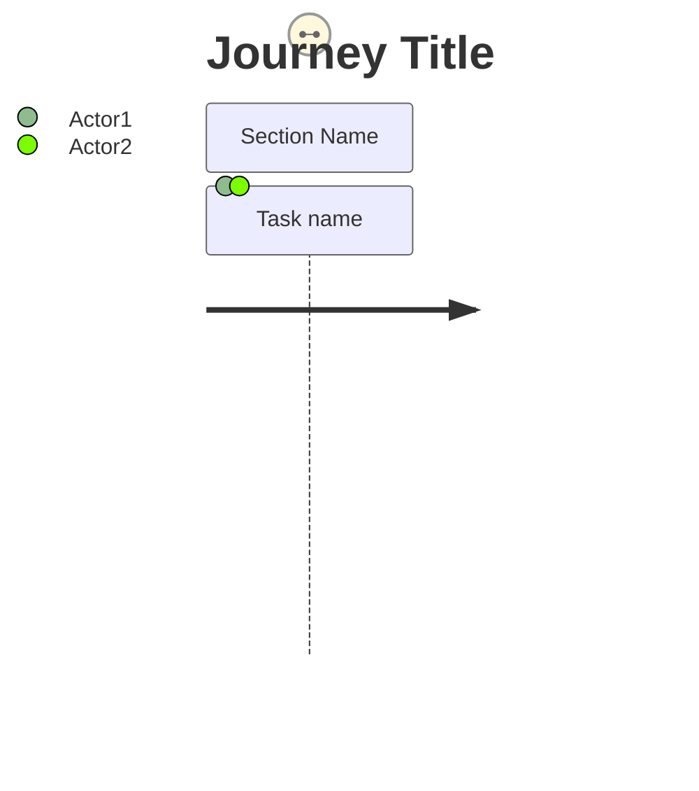

# Narrative Generation Enhancement

## Summary

Enhanced the a11y-mermaid-studio application to generate prose narratives from Mermaid diagrams based on the official Mermaid syntax documentation.

## Changes Made

### 1. Added Gantt Diagram Narrative Support
**Reference**: https://mermaid.js.org/syntax/gantt.html

**Function**: `generateGanttNarrative(source)`

**Features**:
- Extracts project title
- Parses sections and tasks
- Identifies task tags: `milestone`, `done`, `active`, `crit`
- Generates hierarchical narrative:
  - Project title
  - Sections with nested task lists
  - Tags shown in italics (e.g., "in progress", "critical")

**Example Output**:
```
Project Timeline:
Software Development Project

• Planning
  • Requirements gathering (completed)
  • Architecture design (completed)
• Development
  • Backend API development (in progress)
  • Frontend development (critical)
  • Database setup (completed)
```

### 2. Added User Journey Narrative Support
**Reference**: https://mermaid.js.org/syntax/userJourney.html

**Function**: `generateUserJourneyNarrative(source)`

**Features**:
- Extracts journey title
- Parses sections and steps
- Extracts task format: `"Task name: <score>: <actors>"`
- Calculates satisfaction based on score (1-5):
  - 4-5: 😊 positive
  - 3: 😐 neutral
  - 1-2: 😞 negative
- Shows actors involved in each step

**Example Output**:
```
User Journey:
My working day

Go to work:
1. Make tea (by Me) — 😊 positive experience (5/5)
2. Go upstairs (by Me) — 😐 neutral experience (3/5)
3. Do work (by Me, Cat) — 😞 negative experience (1/5)

Go home:
1. Go downstairs (by Me) — 😊 positive experience (5/5)
2. Sit down (by Me) — 😊 positive experience (5/5)
```

### 3. Updated Diagram Type Detection
**Modified**: `detectDiagramType(source)`

**Added detection for**:
- `gantt` diagrams
- `journey` diagrams

### 4. New Example Files

**Created**:
- `examples/gantt-project.mmd` - Software development project timeline
- `examples/journey-workday.mmd` - Working day journey (from docs)
- `examples/journey-support.mmd` - Customer support experience

**Updated**:
- `examples/manifest.json` - Added 3 new examples (version 1.1)

## Technical Details

### Syntax Parsing

**Gantt Diagrams**:
```mermaid
gantt
    title Project Title
    section Section Name
    Task name :done, active, crit, milestone, taskId, start, duration
```

**User Journey**:


### Key Implementation Details

1. **Gantt parsing**:
   - Regex: `/^([^:]+)\s*:\s*(.+)$/` for task lines
   - Tag detection: Check params for keywords (`milestone`, `done`, `active`, `crit`)
   - Skip keyword lines (`gantt`, `title`, `dateFormat`, etc.)

2. **Journey parsing**:
   - Regex: `/^([^:]+)\s*:\s*(\d+)\s*:\s*(.+)$/` for task lines
   - Score is parsed as integer (1-5 scale)
   - Actors split by comma and trimmed
   - Satisfaction emoji based on score threshold

3. **XSS Prevention**:
   - All user-provided text escaped via `escapeHtml()`
   - Uses `textContent` → `innerHTML` pattern

## Testing

**Status**: ✅ All 85 tests pass

**Test files**:
- regression.test.js (9 tests)
- features.test.js (9 tests)
- ui.test.js (13 tests)
- edit-workflow.test.js (9 tests)
- random-button.test.js (12 tests)
- integration.test.js (13 tests)
- visual-validation.test.js (10 tests)
- accessibility.test.js (10 tests)

## Commits

1. `6399128` - Add gantt and user journey narrative generation based on official Mermaid syntax
2. `db7c5bd` - Add gantt and user journey example diagrams with narrative support

## How to Test

1. Open http://localhost:8008 (server already running)
2. Click "Random" button multiple times to see different diagram types
3. Look for gantt or journey diagrams
4. Check the "Diagram Narrative" section below the SVG Code

**Or manually paste**:
- Copy content from `examples/gantt-project.mmd`
- Copy content from `examples/journey-workday.mmd`
- Copy content from `examples/journey-support.mmd`

## Future Enhancements

Based on official Mermaid docs, could add narrative support for:
- Sequence diagrams (interactions over time)
- State diagrams (state transitions)
- ER diagrams (entity relationships)
- Timeline diagrams
- Mind maps

## Documentation References

All narrative generation follows official Mermaid syntax:
- Flowchart: https://mermaid.js.org/syntax/flowchart.html
- Gantt: https://mermaid.js.org/syntax/gantt.html
- Pie: https://mermaid.js.org/syntax/pie.html
- User Journey: https://mermaid.js.org/syntax/userJourney.html
